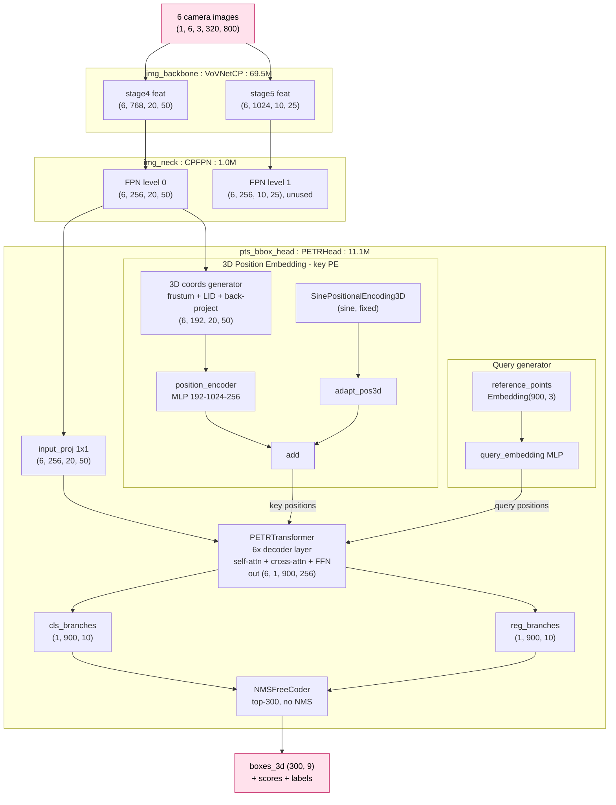
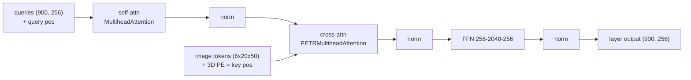

# PETR model structure (VoVNet-p4-800×320) — quick reference

A compact map of the actual `nn.Module` tree, with parameter counts and the
forward data-flow. Generated from the real built model (81.7 M params).

> Regenerate any of this live:
> `python3 study/trace_shapes.py` (shapes) · `print(model)` (full repr) ·
> `model.named_modules()` (every layer).

---

## Architecture diagram

End-to-end model (Mermaid — renders in VS Code's Markdown preview and on GitHub):



One **decoder layer** (`operation_order = self_attn, norm, cross_attn, norm, ffn, norm`):



---

## 1. The whole model in one tree

```
Petr3D                                                   81.7 M   (camera-only detector)
├─ img_backbone : VoVNetCP                               69.5 M   ← 85% of weights
│   ├─ stem            Sequential                         0.11 M
│   ├─ stage2          _OSA_stage                         1.00 M
│   ├─ stage3          _OSA_stage                         7.29 M
│   ├─ stage4          _OSA_stage                        40.54 M  → out "stage4" (768 ch)
│   └─ stage5          _OSA_stage                        20.58 M  → out "stage5" (1024 ch)
├─ img_neck : CPFPN                                       1.0 M
│   ├─ lateral_convs   ModuleList(2× ConvModule 1×1)      0.46 M  (768→256, 1024→256)
│   └─ fpn_convs       ModuleList(2× ConvModule 3×3)      0.59 M
├─ pts_bbox_head : PETRHead                              11.1 M   ← all the PETR logic
│   ├─ input_proj        Conv2d(256→256, 1×1)             0.07 M
│   ├─ positional_encoding SinePositionalEncoding3D       0      (sine, no weights)
│   ├─ position_encoder  Sequential(Conv 192→1024→256)    0.46 M  ← THE 3D PE MLP
│   ├─ adapt_pos3d       Sequential(Conv 384→1024→256)    0.66 M  (adapts sine PE)
│   ├─ reference_points  Embedding(900, 3)               ~0.003M  ← 900 3D anchor queries
│   ├─ query_embedding   Sequential(Lin 384→256→256)      0.16 M
│   ├─ transformer       PETRTransformer                  9.47 M  ← 6-layer decoder
│   ├─ cls_branches      ModuleList(6× shared head)       0.14 M  (256→256→256→10)
│   ├─ reg_branches      ModuleList(6× shared head)       0.13 M  (256→256→256→10)
│   └─ loss_cls/bbox/iou Focal / L1 / GIoU                0      (used only in training)
└─ grid_mask : GridMask                                   0      (train-only image aug)
```

Param distribution (why training cost lives in the backbone):

| block | params | share |
|---|---:|---:|
| img_backbone (VoVNet-99) | 69.5 M | 85% |
| pts_bbox_head | 11.1 M | 14% |
| └─ of which transformer | 9.47 M | — |
| img_neck (CPFPN) | 1.0 M | 1% |
| grid_mask | 0 | — |

---

## 2. Forward data-flow (with real shapes)

Input `img = (1, 6, 3, 320, 800)` — batch 1, 6 cameras, 320×800.

```
img (1,6,3,320,800)
   │  VoVNetCP (per image)
   ▼
[stage4 (6,768,20,50), stage5 (6,1024,10,25)]
   │  CPFPN
   ▼
[lvl0 (6,256,20,50), lvl1 (6,256,10,25)]          ── head uses lvl0 (position_level=0)
   │
   ├─ input_proj 1×1 ─────────────► x        (6,256,20,50)
   │
   │   3D POSITION EMBEDDING (the key PE)
   ├─ position_encoder( coords3d )  (6,192,20,50) → (6,256,20,50)   # 192 = 3 xyz × 64 depths
   ├─ positional_encoding(mask)     (1,6,20,50)   → (1,6,384,20,50) # sine 3D
   ├─ adapt_pos3d(sine)             (6,384,20,50) → (6,256,20,50)
   │      pos_embed = 3D_PE + adapt_pos3d(sine)
   │
   │   QUERIES
   ├─ reference_points (900,3) ─► pos2posemb3d ─► query_embedding (900,384)→(900,256)
   │
   ▼  PETRTransformer: 6× decoder layers (self-attn, cross-attn over the 6×20×50 keys)
out_dec (6, 1, 900, 256)                          # one output per decoder layer
   │  per layer:
   ├─ cls_branches[l] → (1,900,10)                # class logits
   └─ reg_branches[l] → (1,900,10)                # box code (cx,cy,w,l,cz,h,sin,cos,vx,vy)
   ▼  NMSFreeCoder.decode (top-300, no NMS)
boxes_3d (300,9)=(x,y,z,w,l,h,yaw,vx,vy), scores (300,), labels (300,)
```

---

## 3. The decoder layer (×6, weights NOT shared between layers)

`transformer.decoder` = `PETRTransformerDecoder` → `layers: ModuleList(6)` +
`post_norm: LayerNorm`. Each layer is a `PETRTransformerDecoderLayer` with
`operation_order = (self_attn, norm, cross_attn, norm, ffn, norm)`:

```
PETRTransformerDecoderLayer
├─ attentions : ModuleList
│   ├─ [0] MultiheadAttention      ← SELF-attn among the 900 queries
│   └─ [1] PETRMultiheadAttention  ← CROSS-attn: queries → image tokens (+3D PE)
├─ ffns  : ModuleList[ FFN ]       ← 256 → 2048 → 256
└─ norms : ModuleList[ LayerNorm ×3 ]   (one after each of self/cross/ffn)
```

This is a standard DETR decoder layer; the only twist is `PETRMultiheadAttention`
(cross-attention), where the **keys carry the 3D PE** — that's what makes
attention 3D-aware. (See `3D_PE_DEEPDIVE.md`.)

---

## 4. The prediction heads (per decoder layer)

```
cls_branch:  Linear(256→256) → LayerNorm → ReLU   (×2)  → Linear(256→10)
reg_branch:  Linear(256→256) → ReLU               (×2)  → Linear(256→10)
```
- `cls_branches`/`reg_branches` are `ModuleList`s that hold the **same** module
  6 times ⇒ **weights are shared across all 6 layers** (that's why each reports
  only ~0.13 M, not ×6). Every layer is supervised (deep supervision).
- The reg head predicts an *offset*; the query's reference point is added before
  sigmoid (anchor refinement). 10-d code is later turned into a 9-d box by
  `denormalize_bbox`.

---

## 5. The 3D-PE blocks (PETR's contribution)

```
position_encoder : Conv2d(192→1024, 1×1) → ReLU → Conv2d(1024→256, 1×1)   # the learned 3D PE
positional_encoding : SinePositionalEncoding3D                            # fixed sine 3D PE
adapt_pos3d : Conv2d(384→1024, 1×1) → ReLU → Conv2d(1024→256, 1×1)        # adapts sine PE
reference_points : Embedding(900, 3)                                      # learnable 3D anchors
query_embedding  : Linear(384→256) → ReLU → Linear(256→256)              # anchor → query
```
`192 = 3 (xyz) × 64 (depth bins)`; `384 = 256 × 3 / 2` (the 3-axis sine PE).

---

## 6. Notes / gotchas

- **Camera-only:** the base detector can hold LiDAR branches (`pts_voxel_layer`,
  `pts_middle_encoder`, …) but they're `None` here, so they don't appear.
- **`grid_mask`** has 0 params; it perturbs images in `forward_train` only and is
  a no-op under `model.eval()`.
- **Shared cls/reg heads** across the 6 decoder layers; **decoder layers
  themselves are not shared** (6 distinct layers, 9.47 M total).
- **`named_children()`** = top level only; **`named_modules()`** = full recursive
  tree; **`print(model)`** = indented repr (very long for VoVNet).

## 7. Where to look in code

| block | file |
|---|---|
| `Petr3D` (glue) | [detectors/petr3d.py](../projects/mmdet3d_plugin/models/detectors/petr3d.py) |
| `VoVNetCP` | [backbones/vovnetcp.py](../projects/mmdet3d_plugin/models/backbones/vovnetcp.py) |
| `CPFPN` | [necks/cp_fpn.py](../projects/mmdet3d_plugin/models/necks/cp_fpn.py) |
| `PETRHead` (3D PE, heads, loss) | [dense_heads/petr_head.py](../projects/mmdet3d_plugin/models/dense_heads/petr_head.py) |
| `PETRTransformer*` (decoder) | [models/utils/petr_transformer.py](../projects/mmdet3d_plugin/models/utils/petr_transformer.py) |
| `SinePositionalEncoding3D` | [models/utils/positional_encoding.py](../projects/mmdet3d_plugin/models/utils/positional_encoding.py) |
| `NMSFreeCoder` | [core/bbox/coders/nms_free_coder.py](../projects/mmdet3d_plugin/core/bbox/coders/nms_free_coder.py) |

See also: `STUDY_GUIDE.md`, `3D_PE_DEEPDIVE.md`, `TRAINING_GUIDE.md`.
