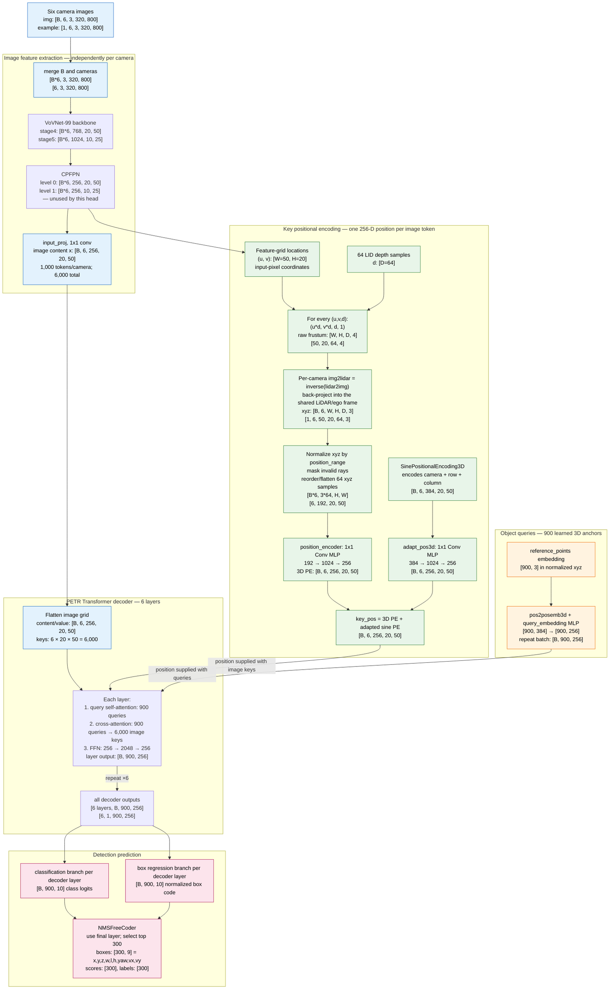
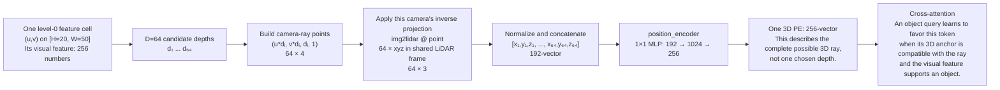

# PETR detailed data-flow diagram (with tensor shapes)

This diagram follows the checked-in `petr_vovnet_gridmask_p4_800x320` model.
It uses `B` for batch size. The example shapes use `B=1`, six nuScenes cameras,
and an image size of `320 x 800`.

## End-to-end inference

## Zoom-in: exactly what happens to one image token

## Shape ledger

| Quantity | Shape | Meaning |
|---|---:|---|
| Input images | `[B, 6, 3, 320, 800]` | batch, cameras, BGR/RGB channels, height, width |
| Head feature level | `[B, 6, 256, 20, 50]` | stride-16 image features |
| Geometry before flattening | `[B, 6, 50, 20, 64, 3]` | one LiDAR-frame 3D point per camera, cell, and sampled depth |
| Geometry fed to `position_encoder` | `[B*6, 192, 20, 50]` | $192=64\times3$ coordinate channels for each cell |
| 3D position embedding | `[B, 6, 256, 20, 50]` | one learned 3D position vector per image token |
| Sine/view position embedding | `[B, 6, 384, 20, 50]` | fixed camera/row/column encoding before adaptation |
| Final key position | `[B, 6, 256, 20, 50]` | $\mathrm{3D\ PE}+\mathrm{adapted\ sine\ PE}$ |
| Image keys/values | `[B, 6000, 256]` conceptually | $6\times20\times50=6000$ image tokens |
| Query positions | `[B, 900, 256]` | 900 learned normalized 3D reference points encoded into transformer space |
| Decoder output | `[6, B, 900, 256]` | six decoder layers, retained for deep supervision |
| Final predictions | `[B, 900, 10]` | 10 class logits and 10 regression values before decoding |

## The key interpretation

PETR does **not** turn a pixel into 64 separate transformer tokens, and it does
not select one of the 64 depths before attention. It uses the 64 back-projected
points to construct a 192-number geometry descriptor, maps that descriptor to
one 256-D positional embedding, and attaches it to the corresponding **single**
image token. Thus the transformer has 6,000 image tokens, not
$6\times20\times50\times64=384,000$ tokens.

The relevant implementation is `PETRHead.position_embeding()` in
[`petr_head.py`](../projects/mmdet3d_plugin/models/dense_heads/petr_head.py#L282-L327),
and the addition of the two key-position components is in
[`petr_head.py`](../projects/mmdet3d_plugin/models/dense_heads/petr_head.py#L390-L405).